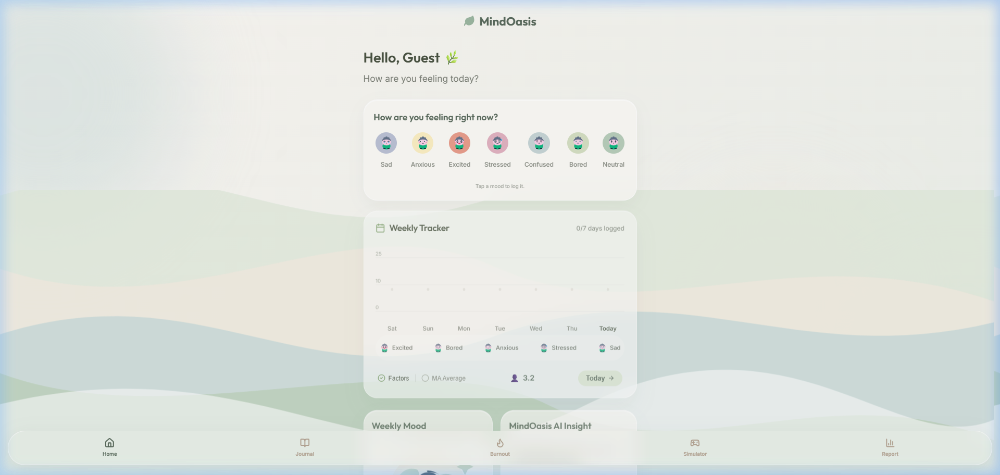
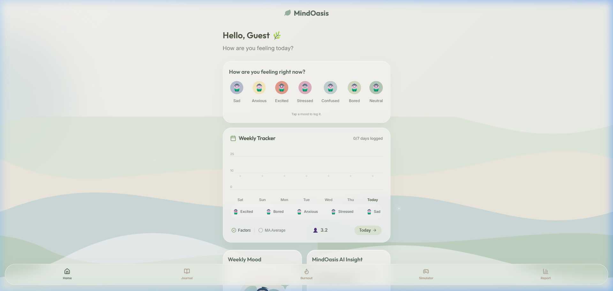
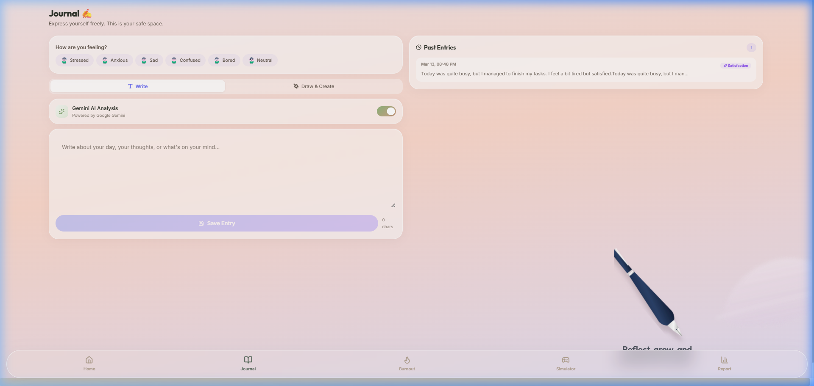
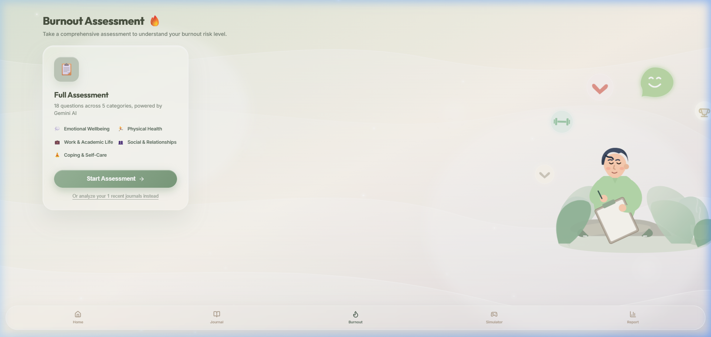
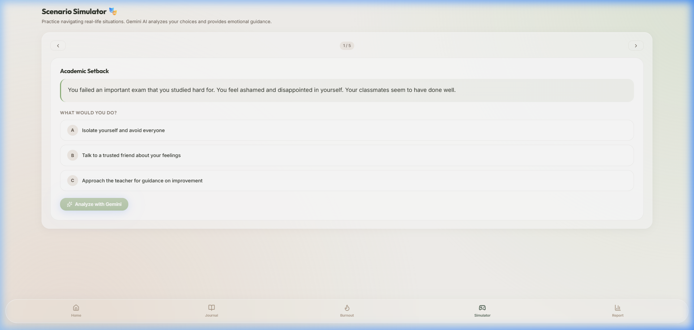
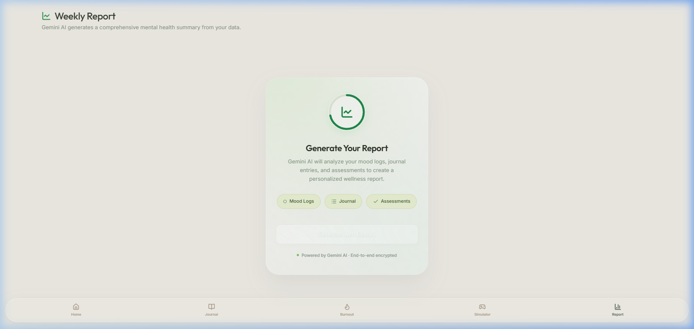
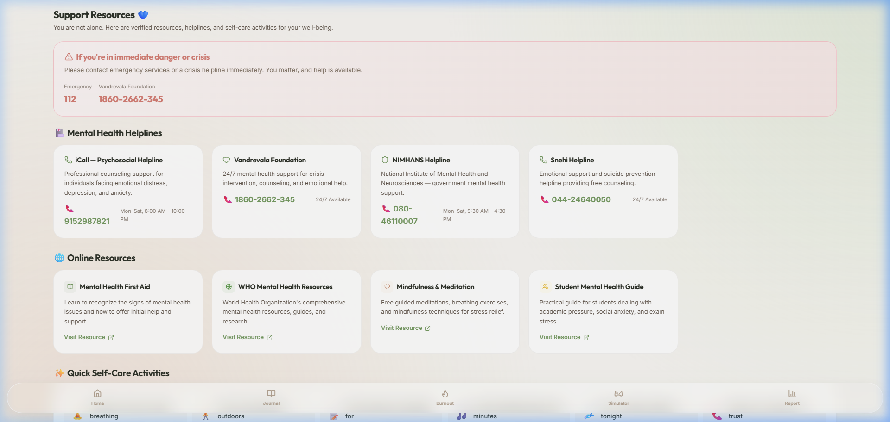
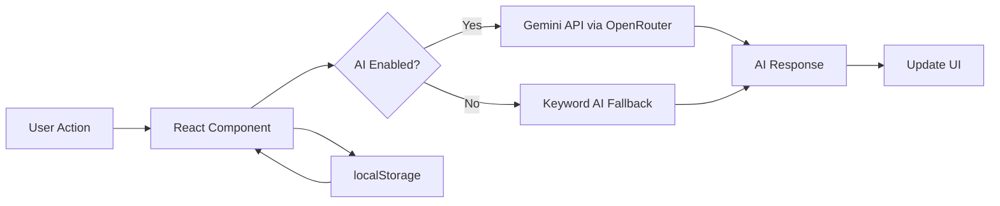

<p align="center">
  
  
  
  
  
</p>

<h1 align="center">🧠 MindOasis</h1>
<h3 align="center"><em>Your AI-Powered Mental Wellness Companion</em></h3>

<p align="center">
  MindOasis is a premium, privacy-first mental wellness platform that helps you track moods, journal your thoughts, assess burnout risk, and navigate real-life stressors — all powered by <strong>Google Gemini AI</strong>.
</p>

<p align="center">
  <a href="#-features">Features</a> •
  <a href="#-screenshots">Screenshots</a> •
  <a href="#-quick-start">Quick Start</a> •
  <a href="#%EF%B8%8F-architecture">Architecture</a> •
  <a href="#-ai-engine">AI Engine</a> •
  <a href="#-contributing">Contributing</a>
</p>

---

## ✨ Features

### 🎭 Mood Tracking & Dashboard
- Log daily moods with expressive anime-style companion avatars
- 7-day visual timeline with bar chart analytics powered by Chart.js
- Dynamic pastel wave backgrounds that shift with your mood
- Streak tracking to build healthy habits
- AI-generated daily wellness insights

### ✍️ Emotional Journaling
- Free-form journaling with a clean, distraction-free editor
- **Gemini AI Analysis** — automatically detects emotional tone, stress triggers, and sentiment
- **Art Therapy Canvas** — full drawing tool with pen, eraser, stickers, custom brush sizes, undo/redo, and background colors
- Stamp your custom avatar companion directly onto drawings
- Attach drawings to journal entries for visual self-expression

### 🔥 Burnout Assessment
- Comprehensive multi-step questionnaire evaluating stress, sleep, workload, and exhaustion
- Combines questionnaire answers with journal history for context-aware analysis
- Gemini AI calculates burnout risk level (Low / Moderate / High) with personalized recommendations
- Beautiful animated burnout illustration with risk visualization

### 🎭 Scenario Simulator
- Practice navigating 5 real-life stressors: Academic Setback, Social Exclusion, Overwhelming Workload, Family Disagreement, and Imposter Syndrome
- Make a choice from realistic options, and Gemini AI analyzes the **likely outcome**, **emotional consequence**, and **recommended approach**
- Learn healthy coping strategies through interactive exploration

### 📊 Weekly Wellness Report
- One-click AI-generated comprehensive mental health report
- Doughnut chart visualization of mood distribution
- Wellness score (0–100), dominant mood, stress trigger analysis
- Positive behavior recognition and actionable recommendations

### 💙 Support Resources
- Verified Indian mental health helplines (iCall, Vandrevala Foundation, NIMHANS, Snehi)
- Emergency contact banner for crisis situations
- Curated online resources (WHO, Headspace, Students Against Depression)
- Quick self-care activity suggestions across 8 categories

### 🧸 Companion System
- Choose from 3 customizable anime-style SVG companions — Neutral, Boy, or Girl
- Your companion reflects your daily mood with 7 expressive facial animations
- Use your companion as a sticker in the drawing canvas

---

## 📸 Screenshots

<table>
  <tr>
    <td align="center"><b>Onboarding</b></td>
    <td align="center"><b>Dashboard</b></td>
  </tr>
  <tr>
    <td></td>
    <td></td>
  </tr>
  <tr>
    <td align="center"><b>Journal</b></td>
    <td align="center"><b>Burnout Assessment</b></td>
  </tr>
  <tr>
    <td></td>
    <td></td>
  </tr>
  <tr>
    <td align="center"><b>Scenario Simulator</b></td>
    <td align="center"><b>Weekly Report</b></td>
  </tr>
  <tr>
    <td></td>
    <td></td>
  </tr>
  <tr>
    <td align="center" colspan="2"><b>Support Resources</b></td>
  </tr>
  <tr>
    <td colspan="2" align="center"></td>
  </tr>
</table>

---

## 🚀 Quick Start

### Prerequisites
- [Node.js](https://nodejs.org/) v18+ 
- An [OpenRouter](https://openrouter.ai/) API key (for Gemini AI features)

### Installation

```bash
# Clone the repository
git clone https://github.com/Sasha-Mx/mindOASIS.git
cd mindOASIS

# Install dependencies
npm install

# Configure your API key
# Create a .env file in the root directory:
echo "VITE_OPENROUTER_API_KEY=your_openrouter_api_key_here" > .env

# Start the development server
npm run dev
```

The app will be available at **http://localhost:5173**

### Build for Production

```bash
npm run build
npm run preview
```

---

## 🏗️ Architecture

### Tech Stack

| Layer | Technology |
|-------|-----------|
| **Framework** | React 19.2 |
| **Build Tool** | Vite 7.3 |
| **Routing** | React Router DOM 7.13 |
| **AI Backend** | Google Gemini 2.0 Flash via OpenRouter |
| **Charts** | Chart.js 4.5 + react-chartjs-2 |
| **Icons** | Lucide React |
| **Styling** | Vanilla CSS with glassmorphism design system |
| **Storage** | Browser localStorage (privacy-first, no server) |

### Project Structure

```
mindOASIS/
├── public/                  # Static assets
├── src/
│   ├── components/          # Reusable UI components
│   │   ├── AnalyticalTracker.jsx   # Mood analytics charts
│   │   ├── DrawingCanvas.jsx       # Art therapy canvas
│   │   ├── MoodAvatar.jsx          # Anime companion SVG avatars
│   │   ├── MoodActivities.jsx      # Mood-based activity suggestions
│   │   ├── Layout.jsx              # App shell with navigation
│   │   ├── ShaderBackground.jsx    # Animated gradient backgrounds
│   │   ├── DynamicHomeBackground.jsx
│   │   ├── JournalBackground.jsx
│   │   ├── BurnoutBackground.jsx
│   │   ├── BurnoutIllustration.jsx
│   │   ├── LoginIllustration.jsx
│   │   ├── MeditatingAvatar.jsx
│   │   └── Toast.jsx               # Global notification system
│   ├── context/
│   │   └── UserContext.jsx          # User session management
│   ├── pages/
│   │   ├── Dashboard.jsx            # Home — mood logging & insights
│   │   ├── Journal.jsx              # Journaling with AI analysis
│   │   ├── Burnout.jsx              # Burnout risk assessment
│   │   ├── Simulator.jsx            # Scenario practice simulator
│   │   ├── Report.jsx               # Weekly wellness report
│   │   ├── Resources.jsx            # Helplines & self-care
│   │   └── Signup.jsx               # Onboarding & avatar selection
│   ├── services/
│   │   ├── gemini.js                # Gemini AI API integration
│   │   ├── ai.js                    # Keyword-based fallback AI engine
│   │   ├── scenarios.js             # Simulator scenario data
│   │   └── storage.js               # localStorage data layer
│   ├── utils/
│   │   └── svgToImage.js            # Avatar SVG-to-image converter
│   ├── App.jsx                      # Root component with routing
│   ├── main.jsx                     # Entry point
│   └── index.css                    # Complete design system
├── .env                             # API key configuration
├── vite.config.js
└── package.json
```

### Data Flow



---

## 🤖 AI Engine

MindOasis uses **Google Gemini 2.0 Flash** via OpenRouter's API for all AI features:

| Feature | AI Capability |
|---------|--------------|
| **Journal Analysis** | Detects emotional tone, stress triggers, sentiment score, and generates empathetic insights |
| **Burnout Assessment** | Evaluates multi-factor burnout risk with personalized key indicators and recommendations |
| **Scenario Simulator** | Analyzes choice consequences, emotional impact, and recommends healthy approaches |
| **Weekly Report** | Synthesizes mood logs, journals, and assessments into a comprehensive wellness report |
| **Daily Insight** | Generates brief, compassionate observations from recent mood patterns |

### Fallback Engine

When no API key is configured, MindOasis gracefully falls back to a **keyword-based simulation engine** (`src/services/ai.js`) that provides offline analysis using pattern matching — ensuring the app works without any external API.

### API Configuration

1. Get an API key from [OpenRouter](https://openrouter.ai/)
2. Create a `.env` file in the project root:
   ```env
   VITE_OPENROUTER_API_KEY=sk-or-v1-your-key-here
   ```
3. Restart the dev server — all AI features will activate automatically

---

## 🔐 Privacy & Data

MindOasis is built with a **privacy-first architecture**:

- **100% client-side** — all data stays in your browser's `localStorage`
- **No user accounts or servers** — your data never leaves your device
- **No tracking or analytics** — zero third-party scripts
- **AI calls are direct** — journal text is sent to Gemini for analysis but never stored externally

### localStorage Keys

| Key | Description |
|-----|-------------|
| `mindoasis_user` | User profile (name, avatar selection) |
| `mindoasis_moods` | Array of mood log entries with timestamps |
| `mindoasis_journals` | Journal entries with AI analysis results |
| `mindoasis_burnout` | Burnout assessment history |

---

## 🎨 Design Philosophy

MindOasis follows a **premium wellness aesthetic** inspired by modern mental health apps:

- **Glassmorphism** — frosted glass cards with subtle backdrop blur
- **Soft Natural Palette** — earthy greens, warm pastels, and calming neutrals
- **Animated Backgrounds** — procedural pastel wave shaders and floating particles
- **Anime-Style Companions** — custom SVG characters with 7 mood-responsive expressions
- **Micro-Animations** — fade-ins, hover effects, and smooth transitions for every interaction
- **Mobile-First Responsive** — fully usable on phones, tablets, and desktops

---

## 🛠️ Available Scripts

| Command | Description |
|---------|-------------|
| `npm run dev` | Start development server with HMR |
| `npm run build` | Build optimized production bundle |
| `npm run preview` | Preview the production build locally |
| `npm run lint` | Run ESLint code quality checks |

---

## 🤝 Contributing

Contributions are welcome! Here's how to get started:

1. **Fork** the repository
2. **Create a branch** — `git checkout -b feature/amazing-feature`
3. **Commit your changes** — `git commit -m 'feat: add amazing feature'`
4. **Push** — `git push origin feature/amazing-feature`
5. **Open a Pull Request**

### Ideas for Contributions
- 🌐 Multi-language support (i18n)
- 🔊 Guided meditation audio player
- 📱 PWA support for offline mobile usage
- 🎨 Additional companion character designs
- 📤 Data export/import functionality
- 🧪 Unit and integration tests

---

## 📄 License

This project is licensed under the **MIT License** — see the [LICENSE](LICENSE) file for details.

---

## 🙏 Acknowledgments

- **[Google Gemini](https://deepmind.google/technologies/gemini/)** — for powering the AI analysis engine
- **[OpenRouter](https://openrouter.ai/)** — for unified AI API access
- **[Lucide Icons](https://lucide.dev/)** — for the beautiful icon set
- **[Chart.js](https://www.chartjs.org/)** — for data visualization
- **Indian Mental Health Helplines** — for their critical life-saving services

---

<p align="center">
  Made with 💚 for mental wellness
  <br />
  <em>Remember: Seeking help is a sign of strength, not weakness.</em>
</p>
